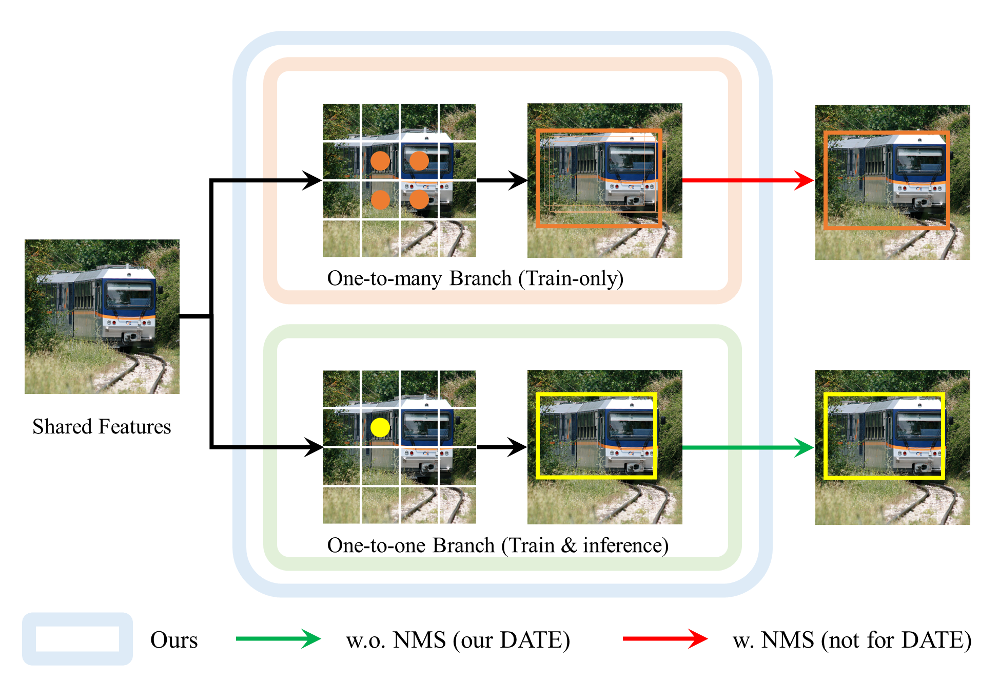
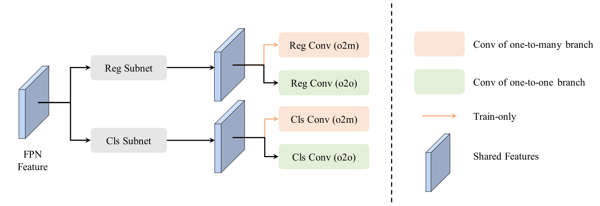

# DATE: Dual Assignment for End-to-End Fully Convolutional Object Detection

 

Fully convolutional detectors discard the one-to-many assignment and adopt a one-to-one assigning strategy to achieve end-to-end detection but suffer from the slow convergence issue. In this paper, we revisit these two assignment methods and find that bringing one-to-many assignment back to end-to-end fully convolutional detectors helps with model convergence. Based on this observation, we propose **D**ual **A**ssignment for end-to-end fully convolutional de**TE**ction (**DATE**). Our method constructs two branches with one-to-many and one-to-one assignment during training and speeds up the convergence of the one-to-one assignment branch by providing more supervision signals. DATE only uses the branch with the one-to-one matching strategy for model inference, which doesn't bring inference overhead. 

## Performance

### Performance on COCO

| Model       | epoch | AP | AP50 | AP75 | APs | APm | APl | Download |
| ----------- | ----- | -- | ---- | ---- | --- | --- | --- | ---------- |
| DATE-R50-F  | 12    |37.3| 55.3 | 40.7 | 21.2| 40.3| 48.8| [Weights](https://mailsdueducn-my.sharepoint.com/:u:/g/personal/201700181055_mail_sdu_edu_cn/EZ3CzL3SVgtEkccSjsz0-CcBUbZasnvOXRYKnCMu6qfRYA?e=vPzh0n) |
| DATE-R50-R  | 12    |37.0| 54.9 | 40.4 | 20.5| 39.8| 49.0| [Weights](https://mailsdueducn-my.sharepoint.com/:u:/g/personal/201700181055_mail_sdu_edu_cn/EQiJyIZ5m4tCjgz_ORscvxQBX5PAvAWds0UdZxNk-zCDJQ?e=ax9Ty1) |
| DATE-R50-F  | 36    |40.6| 58.9 | 44.4 | 25.6| 44.1| 50.9| [Weights](https://mailsdueducn-my.sharepoint.com/:u:/g/personal/201700181055_mail_sdu_edu_cn/EfpK-HGolPBCv9Zv0j0739gB5ifDEViNJ4HBZTlu7-6a9w?e=mTfdzm) |
| DATE-R101-F | 36    |42.2| 60.6 | 46.3 | 26.6| 45.8| 54.1| [Weights](https://mailsdueducn-my.sharepoint.com/:u:/g/personal/201700181055_mail_sdu_edu_cn/EVDHUZemYPhOkcdkXvJD67cBtHdnO0941t4_h5M9OGUcjw?e=Clpo0e) |
| DATE-R50-F-3DMF| 12 |38.9| 57.1 | 42.9 | 22.5| 42.1| 51.3| [Weights](https://mailsdueducn-my.sharepoint.com/:u:/g/personal/201700181055_mail_sdu_edu_cn/EVAXXEcwhpdMghEzhaQTaqsBYqKfcRdnadPuM4xZiAqiWw?e=C7EokO) |
| DATE-R50-F-3DMF| 36 |42.0| 60.3 | 46.2 | 27.3| 45.5| 53.0| [Weights](https://mailsdueducn-my.sharepoint.com/:u:/g/personal/201700181055_mail_sdu_edu_cn/Ef-J9gQPR3ZOn0UMoci5m2kBHo9S0H-5aM6jNzqj4bWhDw?e=PT18i7) |

**NOTE:** The provided weights of DATE-R50-F produce slightly better results than that reported.

### Performance on CrowdHuman

| Model       | iters | AP50 $\uparrow$ | mMR $\downarrow$  | Recall $\uparrow$ | Download |
| ----------- | ----- | ---- | ---- | ------ | ---------- |
| DATE-R50-F  | 30k   | 90.5 | 49.0 | 97.9   | [Weights](https://mailsdueducn-my.sharepoint.com/:u:/g/personal/201700181055_mail_sdu_edu_cn/EUZdioib2OVAg4TlSlMcDOABrMaP5r6ndA-O4zYrVPZt1Q?e=ig4nbW) |
| DATE-R50-R  | 30k   | 90.6 | 48.4 | 97.9   | [Weights](https://mailsdueducn-my.sharepoint.com/:u:/g/personal/201700181055_mail_sdu_edu_cn/EV7Nxs5KuX1Cr24GshiqJtkB1pmTf3MTbLx5PkVBBtTHvQ?e=ak1EJ6) |

## Installation

Our project is based on [Pytorch](https://pytorch.org/) and [mmdetection](https://github.com/open-mmlab/mmdetection/). Code is tested under Python==3.10, Pytorch>=1.12.0, mmdetection==2.25. Other versions might also work.

Quick install:
```bash
git clone https://github.com/yiqunchen1999/date.git && cd date && bash -i ./install.sh
```

## Dataset

The dataset should be organized as following:
```
date
    |_ configs
    |_ data
        |_ coco
            |_ annotations
                |_ ...
            |_ train2017
                |_ ...
            |_ val2017
                |_ ...
            |_ ...
        |_ CrowdHuman
            |_ annotations
                |_ ...
            |_ Images
                |_ ...
```

### COCO dataset

Please follow the [tutorial of mmdetection](https://mmdetection.readthedocs.io/en/stable/1_exist_data_model.html#prepare-datasets).

### CrowdHuman

1. Download [CrowdHuman](https://www.crowdhuman.org/) to your machine;
2. Unzip and link the folder where CrowdHuman is stored to `date/data/`, i.e., 
```
date
    |_ configs
    |_ data
        |_ coco
        |_ CrowdHuman
            |_ Images
                |_ ...
            |_ annotation_train.odgt
            |_ annotation_val.odgt
            |_ ...
```
3. Run dataset converter to convert the format:
```bash
python tools/dataset_converters/crowdhuman.py
```

## Training and Evaluation

Here are simple examples to train and evaluate DATE-R50-F. More details can be found in the [tutorial of mmdetection](https://mmdetection.readthedocs.io/en/stable/1_exist_data_model.html#).

To train DATE in a machine with 8 GPUs, e.g., DATE-F-R50, please run:
```bash
./tools/dist_train.sh configs/date/date_r50_12e_8x2_fcos_poto_coco.py 8
```

Evaluation with 8 GPUs:
```bash
bash ./tools/dist_test.sh \
    configs/date/date_r50_12e_8x2_fcos_poto_coco.py \
    work_dirs/date_r50_12e_8x2_fcos_poto_coco/latest.pth 8 \
    --eval bbox
```

**NOTE:** We don't promise the code will produce the same numbers due to the randomness.

## Acknowledgement

We want to thank the code of [OneNet](https://github.com/PeizeSun/OneNet) and [DeFCN](https://github.com/Megvii-BaseDetection/DeFCN). 

## LICENSE

This project is open sourced under Apache License 2.0, see [LICENSE](./LICENSE.txt).
